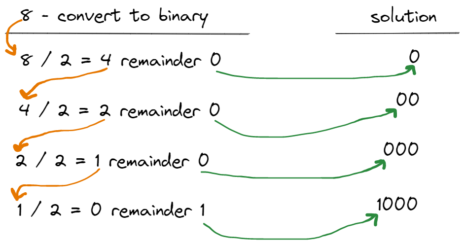

# Command-Line Exercises

## Make change

Write a command-line program which prompts the user for the total bill, and the amount tendered. It should then display the change required.

```
Please enter the amount of the bill: 23.65
Please enter the amount tendered: 100.00
The change required is 76.35
```

## Martian Weight

In case you've ever pondered how much you weigh on Mars, here's the calculation:

    Wm = We* 0.378

where 'Wm' is the weight on Mars, and 'We' is the weight on Earth

Write a command-line program which accepts a series of Earth weights from the user
and displays each Earth weight as itself, and its Martian equivalent.

```
Enter a series of Earth weights (space-separated): 98 235 185

98 lbs.on Earth, is 37 lbs.on Mars.
235 lbs.on Earth, is 88 lbs.on Mars.
185 lbs.on Earth, is 69 lbs.on Mars.
```
### Decimal to binary

Write a command-line program which prompts the user for a series of decimal integer values separated by spaces. Display each decimal integer along with its equivalent binary value.

```
Please enter in a series of decimal values (separated by spaces): 460 8218 1 31313 987654321

460 in binary is 111001100
8218 in binary is 10000000011010
1 in binary is 1
31313 in binary is 111101001010001
987654321 in binary is 111010110111100110100010110001
```

You can convert a decimal number to its binary equivalent by repeatedly dividing the number by two. Prepend the remainder of this division (by definition, a 0 or a 1) to a cumulative string (see the Tips and Tricks section to learn how to *prepend* a value to a string). The process ends when division of the value by two yields a zero.

For example, convert 8 to its binary equivalent of "1000":




| **Value** | **Value / 2** | **Remainder** | **Solution String** |
|:---------:|:-------------:|:-------------:|:--------------:|
|     8     |       4       |       0       |       "0"      |
|     4     |       2       |       0       |      "00"      |
|     2     |       1       |       0       |      "000"     |
|     1     |       0       |       1       |     **"1000"**    |

Try repeating the process yourself to convert 19 to "10011", its binary equivalent.

| **Value** | **Value / 2** | **Remainder** | **Solution String** |
|:---------:|:-------------:|:-------------:|:-------------------:|
|     19    |               |               |                     |
|           |               |               |                     |
|           |               |               |                     |
|           |               |               |                     |
|           |               |               |   **"10011"**       |